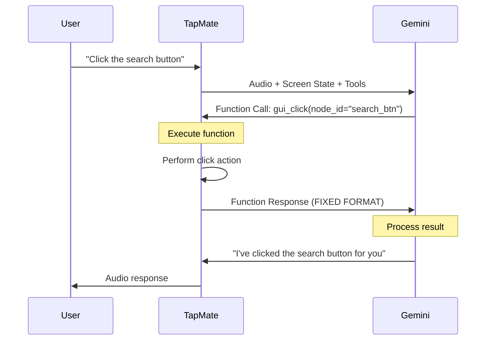

# TapMate vs TARS: Function Calling Comparison

## Side-by-Side Comparison

### Function Response Format

| Aspect | TapMate (BROKEN ❌) | TARS (WORKING ✅) |
|--------|---------------------|-------------------|
| **Wrapper** | `realtimeInput` | `clientContent` |
| **Structure** | Flat functionResponse | Nested turns → parts → functionResponse |
| **Role** | Missing | `"role": "user"` |
| **Completion Signal** | Missing | `"turn_complete": true` |

### Visual Comparison

#### TapMate OLD (BROKEN) ❌

```json
{
  "realtimeInput": {
    "functionResponse": {
      "name": "gui_click",
      "id": "abc123",
      "response": {
        "result": "Button clicked successfully"
      }
    }
  }
}
```

**Problem**: This format is NOT what Gemini Live API expects for function responses!

#### TapMate NEW (FIXED) ✅

```json
{
  "clientContent": {
    "turns": [
      {
        "role": "user",
        "parts": [
          {
            "functionResponse": {
              "name": "gui_click",
              "id": "abc123",
              "response": {
                "result": "Button clicked successfully"
              }
            }
          }
        ]
      }
    ],
    "turn_complete": true
  }
}
```

**Solution**: Matches TARS's format and Gemini's expectations!

---

## Parameter Schema Comparison

### Tool Definition Format

#### TapMate OLD (BROKEN) ❌

```json
{
  "name": "gui_click",
  "description": "Click an element",
  "parameters": {
    "type": "OBJECT",
    "properties": {
      "node_id": {
        "type": "STRING",
        "description": "Element to click"
      }
    },
    "required": ["node_id"]
  }
}
```

**Problem**: `"OBJECT"` and `"STRING"` are invalid! JSON Schema uses lowercase.

#### TapMate NEW (FIXED) ✅

```json
{
  "name": "gui_click",
  "description": "Click an element",
  "parameters": {
    "type": "object",
    "properties": {
      "node_id": {
        "type": "string",
        "description": "Element to click"
      }
    },
    "required": ["node_id"]
  }
}
```

**Solution**: Lowercase types match JSON Schema spec and TARS format!

---

## Complete Flow Comparison

### How Function Calling Should Work



### OLD Flow (Why it failed) ❌

```
1. User: "Click the search button"
2. Gemini: {functionCall: "gui_click", args: {...}, id: "123"}
3. TapMate: Executes click
4. TapMate: Sends WRONG FORMAT → {"realtimeInput": {...}}
5. Gemini: ⚠️ ERROR - Invalid format / Timeout waiting
6. TapMate: ❌ Function calling broken
```

### NEW Flow (How it works now) ✅

```
1. User: "Click the search button"
2. Gemini: {functionCall: "gui_click", args: {...}, id: "123"}
3. TapMate: Executes click
4. TapMate: Sends CORRECT FORMAT → {"clientContent": {turns: [...], turn_complete: true}}
5. Gemini: ✅ Processes result successfully
6. Gemini: "I've clicked the search button"
7. TapMate: ✅ Function calling works!
```

---

## All 10 Tools Fixed

### Tools with Parameter Schema Updates

| Tool | Parameters | Type Changes |
|------|-----------|--------------|
| **gui_click** | node_id | STRING → string |
| **gui_type** | node_id, text | STRING → string |
| **gui_scroll** | direction | STRING → string, OBJECT → object |
| **memory_save** | key, value, type, trigger_time | STRING → string, NUMBER → number, OBJECT → object |
| **memory_recall** | type | STRING → string, OBJECT → object |
| **google_search** | query | STRING → string, OBJECT → object |
| **maps_navigation** | destination | STRING → string, OBJECT → object |
| **get_location** | (no params) | OBJECT → object |
| **weather** | location | STRING → string, OBJECT → object |
| **gui_open_app** | app_name | STRING → string, OBJECT → object |

---

## Key Takeaways

### What TARS Does Right ✅

1. **Proper Message Structure**: Uses `clientContent` with turns
2. **Correct Schema Types**: Lowercase type names
3. **Turn Completion**: Always signals `turn_complete: true`
4. **Proper Role Attribution**: Function responses are user turns
5. **Clean Error Handling**: Detailed logging for debugging

### What TapMate Was Doing Wrong ❌

1. **Wrong Wrapper**: Used `realtimeInput` instead of `clientContent`
2. **Missing Structure**: No turns/parts hierarchy
3. **Invalid Types**: UPPERCASE instead of lowercase
4. **No Completion Signal**: Gemini waited forever
5. **Missing Role**: No role attribution for function responses

### What's Fixed Now ✅

1. ✅ Function response structure matches TARS
2. ✅ All parameter types are lowercase
3. ✅ Turn completion signal added
4. ✅ Proper turns/parts hierarchy
5. ✅ Enhanced debug logging

---

## Testing Checklist

- [ ] Test `gui_click` - Click a button
- [ ] Test `gui_type` - Type text in field
- [ ] Test `gui_scroll` - Scroll up/down
- [ ] Test `memory_save` - Save information
- [ ] Test `memory_recall` - Recall saved data
- [ ] Test `google_search` - Search for info
- [ ] Test `maps_navigation` - Get directions
- [ ] Test `get_location` - Get GPS coords
- [ ] Test `weather` - Check weather
- [ ] Test `gui_open_app` - Open an app

## Debug Monitoring

Watch the logs at: `/Users/matedort/NexHacks/.cursor/debug.log`

Look for:
- `FUNCTION_CALL_RECEIVED` - Gemini requesting function
- `GeminiLiveClient.sendFunctionResponse:SENT` - TapMate sending result
- Any error messages with details

---

**Result**: TapMate now matches TARS's proven, working function calling implementation! 🎉
